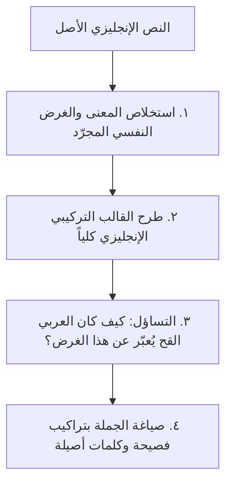

# مهارة الكتابة العربية الفصيحة ونبذ العَرَنْجِيَّة
> مستقاة ومبنية بالكامل على كتاب **«العَرَنْجِيَّة: بلغات أعجمية وألسن عربية»** للترجمان **أحمد الغامدي**.

---

## ١. مفهوم العَرَنْجِيَّة (المنطلق والعلة)

### ما هي العَرَنْجِيَّة؟
العَرَنْجِيَّة (نحت من: **عربية + إفرنجية**) ليست مجرد استعمال كلمات أجنبية صريحة (كالكلمات المعربة: تلفاز، حاسوب، قطار)، بل هي:
> **«لغةٌ عربية في ظاهرها وألفاظها، إفرنجيةٌ في باطنها وتراكيبها وروحها وطرائق تفكيرها»**.

إنها ظاهرة صياغة الكلام العربي على قوالب اللغات الغربية (ولا سيما الإنجليزية والفرنسية)؛ حيث يكتب الكاتب كلاماً مستقيم الإعراب ظاهراً، لكنه لو عُرِضَ على عربيّ سليم السليقة قبل عصر الترجمة لما فهمه أو لمجه سمعه ولأنكره إنكاراً تاماً، بينما يفهمه الإفرنجي إذا تُرجِمَ له حرفياً لأنه نسخته المطابقة!

### آفة "تصيّد آحاد المولدات"
أكبر خطأ يقع فيه دارسو اللغة والمحررون هو الاقتصار على ملاحقة كلمات مشهورة كـ `(لعب دوراً)` أو `(صنعت يومي)` أو `(تم إرسال)`، مع البقاء في حمأة التراكيب الإفرنجية العميقة. فالتحرر من العرنجية لا يكون بإبدال كلمة هجينة بأخرى قريبة منها مع استبقاء بنية الجملة الإنجليزية، بل **بإعادة بناء المعنى في النفس على سَنَنِ كلام العرب وأساليبهم**.

---

## ٢. الأصول الكلية للأسلوب العربي الفصيح (The Golden Directives)

| المبدأ العربي الأصيل | المنهج العرنجي الهجين المتفرنج | التوجيه العملي |
| :--- | :--- | :--- |
| **حيوية الجملة الفعلية** | رصف الجمل الاسمية والمبتدآت المطولة | ابدأ بالفعل غالباً لإبراز الحدث والحركة، وتجنب تأخير الفعل إلى ذيل الجملة. |
| **الاشتقاق والتصريف المباشر** | الاستعانة بالأفعال المساعدة (`قام بـ`، `أجرى`) | استعمل الفعل الصريح: `زار` لا `قام بزيارة`، و`فحص` لا `أجرى فحصاً`. |
| **البناء للمعلوم وحفظ الفاعل** | استيراد المبني للمجهول المصحوب بالفاعل | إذا كان الفاعل معلوماً **يحرم** البناء للمجهول؛ قل: `كتبه فلان` ولا تقل: `كُتِبَ من قبل فلان`. |
| **الأصالة في حروف المعاني** | تعريب حروف الجر الغربية (`من خلال`، `بواسطة`) | استعمل حروف الجر العربية بمعانيها الوضيعة: الباء، اللام، في، على، عن. |
| **العطف والوصل والاستئناف** | محاكاة علامات الترقيم الإنجليزية والجمل المعترضة | اربط الجمل بواو العطف والفاء وثم، ولا تحشر الشَّرطات والأقواس والاعتراضات الإفرنجية. |
| **إحياء السعة المعجمية** | الإماتة والتغليب (حصر المعاني في كلمة مترجمة واحدة) | لا تستعمل كلمة واحدة (`مشكلة`، `تحدي`) لعشرات المعاني، بل استعمل: `معضلة`، `بلية`، `خطب`، `مأزق`، `أزمة`. |
| **ترجمة المعنى لا المبنى** | محاذاة اللفظ باللفظ (Word-for-word calquing) | افهم الغرض في الإنجليزية، ثم انسَ صياغتها واكتبه كما كان العربي القحّ يبتدئه. |

---

## ٣. سجل الأوامر والنواهي التفصيلي (DOs and DON'Ts Catalog)

---

### الباب الأول: النحو والتراكيب الإعرابية

#### ١. النعت والإضافة وتعدد الصفات
* **العلة في الكتاب**: الإفرنج يكثرون من رصف الصفات قبل الموصوف أو بعده، بينما العرب تستعمل **الإضافة** لبيان الجنس والخصوص، أو تقدم اسم التفضيل المضاف، أو تستعمل النعت المفرد دون تكدس.
* ❌ **لا تقل (عرنجية)**: `اشترى برداً حريرياً في قدح خشبي، وقضى يوماً طويلاً ومثيراً ومتعباً.`
* ✅ **قل (عربي فصيح)**: `اشترى بُرْدَ حريرٍ في قَدَحِ خشبٍ، وقضى يوماً طويلاً أرهقه وشغله.`
* ❌ **لا تقل (عرنجية)**: `هو الرجل الأكثر أهمية والأكثر ذكاءً في الفريق.`
* ✅ **قل (عربي فصيح)**: `هو أهمّ القومِ وأذكاهم.` (تقديم صيغة أفعل التفضيل مضافة، أو: `هو أذكى الفريق وأرفعهم شأناً`).
* ❌ **لا تقل (عرنجية)**: `القرية التي أهلها ظالمون.` (ترجمة تركيب: The village whose people are unjust)
* ✅ **قل (عربي فصيح)**: `القريةِ الظالمِ أهلُها.` (إحياء النعت السببي الفصيح، كما في التنزيل العزيز).

---

#### ٢. ظرف الزمان وتصدر الظروف
* **العلة في الكتاب**: يقتضي الأسلوب الإنجليزي وضع حروف جر للظروف الزمانية مثل `for three days` و`in 1990` وتقديمها في صدر الجملة. أما في العربية فالظرف منصوب بذاته دال على الزمان والمحل، ولا يُقحم فيه اللام ولا يصدر إلا لحصر أو نكتة بلاغية.
* ❌ **لا تقل (عرنجية)**: `أقام في دمشق لمدة ثلاثة أيام، وفي عام 1995 ولد ابنه.`
* ✅ **قل (عربي فصيح)**: `أقام في دمشق ثلاثةَ أيامٍ، ووُلِدَ ابنُه سنةَ 1995م.`
* ❌ **لا تقل (عرنجية)**: `نام لثماني ساعات متواصلة.`
* ✅ **قل (عربي فصيح)**: `نام ثمانيَ ساعاتٍ تباعاً (أو متصلة).`
* ❌ **لا تقل (عرنجية)**: `في الوقت الذي كان فيه يقرأ، طرق الباب.`
* ✅ **قل (عربي فصيح)**: `بينما هو يقرأ طرق الباب / وإنه لفي قراءته إذ طرق الباب.`

---

#### ٣. حروف المعاني وأدوات التعدية الدخيلة
* **العلة في الكتاب**: قام المترجمون المعاصرون باختراع معانٍ ووسائط لحروف الجر لمحاكاة حروف اللغات الأجنبية (`through`, `by`, `against`, `as`, `about`, `with regards to`)، مما أفسد حروف المعاني العربية.

| الغرض الأجنبي | التركيب العرنجي الفاسد ❌ | الصواب العربي الفصيح ✅ | الشاهد والقاعدة |
| :--- | :--- | :--- | :--- |
| `through` | تم ذلك **من خلال** المفاوضات | تم ذلك **بـ**المفاوضات / **في** المفاوضات / **على يد** المفاوضين | "من خلال" تعني وسط الفُرجة الحقيقية (كقوله: فخرج من خلال الشجر). |
| `by / via` | أُرسلت الرسالة **بواسطة** البريد | أُرسلت الرسالة **بـ**البريد / **على يد** ساعي البريد | الباء في العربية تفيد الإلصاق والاستعانة والآلة دون حاجة لـ "بواسطة". |
| `against` | حرب **ضد** الإرهاب / دواء **ضد** الحمى | حربٌ **على** الإرهاب / دواءٌ **لـ**لحمى (أو **يبرئ من** الحمى) | "ضد" اسم معناه الكفء والمناوئ وليست حرف جر؛ تقول: "حاربهم" و"قام في وجههم". |
| `as (profession)` | يعمل **كـ**معلم / يتكلم **كـ**مسؤول | يعمل **معلماً** (حال) / يتكلم **كلامَ** مسؤول | كاف التشبيه لا تدخل على الوظيفة والصفة الحقيقية؛ المعلم لا يشبه معلماً بل هو معلم! |
| `about` | تحدث **حول** المسألة | تحدث **عن** المسألة / خاض **في** المسألة | "حول" ظرف مكان حقيقي لا يُستعمل للموضوع المبحوث فيه. |
| `regarding` | **بالنسبة لـ**ـخالد فهو موافق | **أما** خالدٌ فموافق / وخالدٌ عندي موافق | تركيب "بالنسبة لي" ركيك هجين؛ قل: "أما في رأيي" أو "وعندي أن...". |
| `on the level of` | **على صعيد** الاقتصاد / **على مستوى** الدولة | **في شأن** الاقتصاد / **في أمر** السياسة / **عند** الدولة | الصعيد في العربية هو التراب ووجه الأرض، وإقحامه مجاز إفرنجي سمج. |
| `in favor of` | صوّت **لصالح** القرار | صوّت **مع** القرار / أَيَّدَ القرارَ | "لصالح" ترجمة حرفية لـ in favor of؛ والعرب تقول: له وعليه، معه أو ضده. |

---

#### ٤. المفعول لأجله وبيان الغاية والسبب
* **العلة في الكتاب**: تفتقر الإنجليزية لصيغة المفعول لأجله، فتستعمل تراكيب مساعدة مثل `in order to` و`for the purpose of`. وقد نقلت العرنجية ذلك فقالت `من أجل أن` و`بهدف` و`بغاية`.
* ❌ **لا تقل (عرنجية)**: `سافر إلى القاهرة من أجل دراسة الطب، وقام بإخلاء البيت بهدف تجديده.`
* ✅ **قل (عربي فصيح)**: `سافر إلى القاهرة دراسةً للطب (أو ليدرس الطب)، وأخلى البيت رغبةً في تجديده (أو طلباً لتجديده).`
* **القاعدة**: استعمل **المصدر الصريح المنصوب على أنه مفعول لأجله** (`إجلالاً`، `طلباً`، `حذراً`، `خوفاً`، `ابتغاءَ مرضاة الله`) أو لام التعليل الجازمة/الناصبة.

---

#### ٥. أسلوب الحصر والقصر وموضع "فقط"
* **العلة في الكتاب**: تضع الإنجليزية لفظة الحصر `only` في نهاية الجملة غالبًا (`I saw Ahmad only`). فقلدها كُتّاب العرنجية بوضع `فقط` أو `فحسب` في ذيل الجمل العربية، وأماتوا أساليب الحصر العربية العظيمة.
* ❌ **لا تقل (عرنجية)**: `أريد كوباً من الماء فقط.`
* ✅ **قل (عربي فصيح)**: `ما أريد إلا شربةَ ماء / إنما أريد شربة ماء / لا أريد غيرَ شربة ماء.`
* ❌ **لا تقل (عرنجية)**: `حضر ثلاثة طلاب فقط.`
* ✅ **قل (عربي فصيح)**: `لم يحضر إلا ثلاثةُ طلاب / إنما حضر ثلاثة طلاب.`
* **القاعدة**: استعمل أدوات القصر العربية الأصيلة: `إنما`، النفي والاستثناء بـ `ما ... إلا` أو `لم ... غير`، وتقديم ما حقه التأخير.

---

#### ٦. التشكيك والاحتمال والاستقبال
* **العلة في الكتاب**: ترجمة الأفعال الناقصة الإنجليزية (`may`, `might`, `will`, `would`) بحرفيتها واستعمال `سوف` لكل مستقبل.
* ❌ **لا تقل (عرنجية)**: `هو ربما يكون قد وصل الآن، وسوف لن يذهب غداً.`
* ✅ **قل (عربي فصيح)**: `لعله قد وصل الآن / قد يكون وصل، ولن يذهب غداً.`
* **القواعد**:
  - `سوف` في العربية تفيد التراخي والبعد والتهديد، ولا تلحقها `لن`؛ فلا يقال `سوف لن` قط، بل `لن يذهب`.
  - لا تكرر `ربما` في كل احتمال؛ بل استعمل: `لعل`، `عسى`، `يوشك`، `أحسبه`، `يخال لي`، `قد + الفعل المضارع`.

---

### الباب الثاني: الصرف والاشتقاق والأفعال المساعدة

#### ١. آفة الأفعال المساعدة (Auxiliary Verbs Disease)
* **العلة في الكتاب**: تفتقر اللغات الإفرنجية لمرونة الاشتقاق الصرفي العربي، فتعتمد على الأفعال المساعدة (`do`, `make`, `conduct`, `carry out`, `play`). تسللت هذه الأفعال إلى العربية المعاصرة فصارت نصوصنا مليئة بالتراكيب الميتة:

```
❌ الأسلوب العرنجي الميت: [فعل مساعد فارغ] + [مصدر الفعل الأصلي]
✅ الأسلوب العربي الحي:   [الفعل الصريح المشتق مباشرة]
```

| التعبير العرنجي الهجين ❌ | الصواب العربي الفصيح المباشر ✅ |
| :--- | :--- |
| **قام بزيارة** إلى عمه | **زار** عمه |
| **أجرى تحقيقاً** في المسألة | **حقّق** في المسألة / **استقصى** الأمر |
| **لعب دوراً** كبيراً في النجاح | **أثّر** في النجاح تأثيراً كبيراً / **كان له أثرٌ** عظيم / **نهض بـ**العبء / **بلى فيه بلاءً** حسناً |
| **شكّل خطراً** على المجتمع | **أخاف** المجتمع / **هدّد** المجتمع / **كان خطراً** على المجتمع |
| **أعطى وعداً** بالمساعدة | **وعد** بالمساعدة |
| **وضع حداً** للفوضى | **حسم** الفوضى / **قطع دابر** الفوضى / **أنهى** الفوضى |
| **وجد نفسه** مضطراً للمغادرة | **أُحْرِجَ** إلى المغادرة / **اضطُرّ** إلى الذهاب / **أُلجئ** إليه |
| **وجّه عنايته** نحوه | **عُنِيَ به** / **أقبل عليه** |

---

#### ٢. العدول عن الفعل إلى خبر "كان" وأخواتها
* **العلة في الكتاب**: اضطر الإفرنج لاستعمال فعل الكينونة `to be` مع الصفات لعدم إمكان اشتقاق أفعال منها عندهم (`be patient`, `be honest`, `I was happy`). أما العربية فتزخر بالأفعال الصريحة في الماضي والمضارع والأمر.
* ❌ **لا تقل (عرنجية)**: `كن صابراً، ولا تكن متأخراً، وكن صادقاً مع صاحبك.`
* ✅ **قل (عربي فصيح)**: `اصبِرْ، ولا تتأخرْ، واصدُقْ صاحبَكَ.`
* ❌ **لا تقل (عرنجية)**: `لن أكون راضيةً حتى تخبرني.`
* ✅ **قل (عربي فصيح)**: `لا أرضى حتى تخبرني.` (كما قالت أم النعمان بن بشير: "لا أرضى حتى تشهد رسول الله").
* ❌ **لا تقل (عرنجية)**: `كانت الشجرة جميلةً جداً ونحن فخورون بها.`
* ✅ **قل (عربي فصيح)**: `حَسُنَتِ الشجرةُ وطابت، ونحن نفخرُ بها.`

---

#### ٣. اسم التفضيل المباشر ونبذ (الأكثر / الأقل)
* **العلة في الكتاب**: الإنجليزية تستعمل `more / most + adjective` في الصفات الطويلة، فنقلها المترجمون إلى الأفعال الثلاثية القابلة لصيغة `أفعل` مباشرة!
* ❌ **لا تقل (عرنجية)**: `هذا الموضوع هو الأكثر وضوحاً والأكثر أهمية والأقل صعوبة.`
* ✅ **قل (عربي فصيح)**: `هذا الموضوع هو أوضحُ الأمور وأهمُّها وأهونُها (أو أيسرُها).`
* ❌ **لا تقل (عرنجية)**: `كانت الليلة الأكثر ظلمة وسواداً.`
* ✅ **قل (عربي فصيح)**: `كانت الليلةُ أظلمَ الليالي وأسودَها (أو الليلةُ الظلماء).`
* **القاعدة**: إذا كان الفعل ثلاثياً مستوفياً للشروط **وجب** صياغة اسم التفضيل على وزن `أَفْعَل` مباشرة، ولا يجوز العدول إلى `أكثر + مصدر` إلا فيما تعذر فيه القياس (كالأفعال الزائدة عن ثلاثة أحرف أو الدالة على الألوان والعيوب).

---

#### ٤. صيغة التعدية السببية المباشرة (Causative)
* **العلة في الكتاب**: الإفرنج لا يملكون وزناً للتعدية فيستعملون `make someone sleep / make him laugh`. وفي العرنجية يقولون: `جعله ينام` و`جعله يضحك`!
* ❌ **لا تقل (عرنجية)**: `جعله ينام في الفراش، وجعل الولد يبكي.`
* ✅ **قل (عربي فصيح)**: `أنَامَهُ في الفراش (أو نوَّمه)، وأبْكَى الصبيَّ (أو بكَّاه).`
* **القاعدة**: في العربية تُعدَّى الأفعال بالهمزة (`أفعل`) أو التضعيف (`فعّل`) مباشرة: `أضحك وأبكى`، `أقعد وأقام`، `أنزل ورفع`، ولا حاجة لإقحام "جعل".

---

#### ٥. صيغة التشارك ونبذ حشو "مع بعضهم البعض"
* **العلة في الكتاب**: الإنجليزية تفتقر لوزن التشارك فتستعمل `each other / with one another`. أما في العربية فصيغة `تَفَاعَلَ` تدل بذاتها على الاشتراك بين طرفين فأكثر.
* ❌ **لا تقل (عرنجية)**: `تضاربوا مع بعضهم البعض، وتحدثوا مع بعضهم.`
* ✅ **قل (عربي فصيح)**: `تضاربوا، وتنازعوا، وتحادثوا.`
* ❌ **لا تقل (عرنجية)**: `تعاون الفريق مع بعضه البعض لإنجاز العمل.`
* ✅ **قل (عربي فصيح)**: `تعاونَ الفريقُ على إنجاز العمل.` (صيغة تعاون تغني عن "مع بعضهم").

---

### الباب الثالث: متن اللغة والألفاظ والاستعارات الدخيلة

#### ١. الاستعارات الإنجليزية المترجمة حرفياً (Calqued Metaphors)
* **العلة في الكتاب**: أخذ الكُتاب استعارات مجازية نشأت في البيئة الغربية وترجموها ترجمة حرفية سمجة، فأماتوا بها الاستعارات والتشبيهات والتعابير العربية الأصيلة.

| التعبير العرنجي الهجين ❌ | الأصل الإفرنجي المقابل | البديل العربي الفصيح البليغ ✅ |
| :--- | :--- | :--- |
| **تبنّى فكرةً** / مشروعاً | to adopt an idea | **استحسن** الفكرة / **ارتضاها** / **أخذ بها** / **أقرّها** (التبني في العربية للولد فقط). |
| **عكس مشاعره** / عكست المرآة صورته | to reflect | **أظهر** مشاعره / **أبان عن** دخيلته / **جلّى** أمره / **حكت** المرآة صورته. |
| **أعطاه الضوء الأخضر** | give the green light | **أَذِنَ له** / **رخّص له** / **سوّغ له** / **خلّى بينه وبين أمره**. |
| **قنبلة موقوتة** | a ticking time bomb | **شرٌّ مستطير** / **داهيةٌ دهياء** / **بلاءٌ وشيك**. |
| **غسيل دماغ** | brainwashing | **استهواء** / **سحر العقول** / **إغواء** / **فتنة**. |
| **خطوة بخطوة** | step by step | **شيئاً فشيئاً** / **رويداً رويداً** / **تدرجاً** / **درجةً درجة**. |
| **في نهاية المطاف** | at the end of the day | **في عاقبة الأمر** / **في مآله** / **آخِرَ الأمر** / **خاتمة المطاف**. |
| **أخذ بعين الاعتبار** | take into consideration | **راعى ذلك** / **التفت إليه** / **وضعه في حسبانه** / **أعمل فيه باله**. |
| **نال إعجاب فلان** | won his admiration | **أعجبَ فلاناً** / **راقَ له** / **وقع منه موقع الرضا**. |
| **وجهة نظر** | point of view | **رأيٌ** / **مذهبٌ** / **ما أراه** / **نظرة**. |
| **حجر الزاوية** | cornerstone | **عِماد الأمر** / **قُطْب الرحى** / **أساس البنيان** / **ملاك الأمر**. |
| **على نفس الصعيد** | on the same level | **في هذا السياق** / **في هذا الشأن** / **ومثله أيضاً**. |

---

#### ٢. الكلمات المحرّفة دلالياً والملحونة
* **`تحديات` (Challenges)**:
  - ❌ *عرنجية*: `نواجه اليوم تحديات اقتصادية كبيرة.`
  - ✅ *عربية فصيحة*: `نواجه اليوم **شدائدَ** (أو **مكارهَ**، **صعاباً**، **مآزقَ**، **أزماتٍ**، **خطوباً**) اقتصادية.`
  - 🔍 *العلة*: التحدي في كلام العرب هو المنازعة والمباراة وإظهار الغلبة، وليس هو الصعوبة أو البلاء.
* **`شفافية` (Transparency)**:
  - ❌ *عرنجية*: `نطالب بالشفافية والنزاهة.`
  - ✅ *عربية فصيحة*: `نطالب بـ **الوضوح** و**العلانية** و**النزاهة** و**البراءة** من الدغل.`
* **`محوري` (Pivotal / Central)**:
  - ❌ *عرنجية*: `لعب دوراً محورياً في المؤتمر.`
  - ✅ *عربية فصيحة*: `كان **قطبَ الرحى** في المؤتمر / كان **أعظمَهم أثراً** / دار عليه أمر المؤتمر.`
* **`تغطية` (Coverage)**:
  - ❌ *عرنجية*: `قام التلفاز بتغطية الحدث، وتغطية النفقات.`
  - ✅ *عربية فصيحة*: `**نقل** التلفازُ الخبرَ (أو **بثّه**)، و**أوفى** النفقاتِ (أو **تكفّل بها**).`
* **`إيجابيات وسلبيات` (Pros & Cons / Positive & Negative)**:
  - ❌ *عرنجية*: `لهذا القرار إيجابيات وسلبيات، وكن إيجابياً.`
  - ✅ *عربية فصيحة*: `لهذا القرار **محاسنُ ومساوئ** (أو **منافعُ ومضارّ**، **فضائلُ ومثالب**)، وتفاءلْ واستبشرْ.`
* **`استثنائي` (Exceptional)**:
  - ❌ *عرنجية*: `هو رجل استثنائي، وحقق نجاحاً استثنائياً.`
  - ✅ *عربية فصيحة*: `هو رجلٌ **فريدٌ** / **منقطعُ النظير** / **نسيجُ وحدِه** / **فذٌّ**، وحقق فوزاً عظيماً مبنياً.`

---

#### ٣. مكافحة آفة "الإماتة والتغليب"
* **العلة في الكتاب**: أن تحل كلمة أعجمية المنبت محل عشرات الكلمات والصفات العربية الدقيقة فيموت الثراء المعجمي في أذهان الأجيال.
* **أمثلة على إحياء المترادفات الدقيقة**:
  - **في الشدة والبلاء**: لا تقل دائماً `مشكلة` أو `أزمة`؛ بل استعمل بحسب السياق: `الخطب`، `البلية`، `النائبة`، `الغاشية`، `المعضلة`، `الضائقة`، `المأزق`، `الكربة`.
  - **في مشاعر الحزن**: لا تقصر كلامك على `شعر بالحزن`؛ بل استعمل: `اكتأب`، `وجَم`، `أسِف`، `تلهّف`، `تفجّع`، `كَمِد`، `شَجِيَ`.
  - **في الفرح**: استعمل: `استبشر`، `ابتسم`، `تهلّل وجهه`، `انشرح صدره`، `أنس به`، `جذل`.
  - **في الملازمة والحب**: استعمل: `شَغَف`، `كَلَف`، `صَبابة`، `وَجْد`، `هَيام`.

---

### الباب الرابع: الأساليب وبنية الجملة وتراكيب العبارات

#### ١. المبني للمجهول المصحوب بالفاعل (Passive Calque)
* **العلة في الكتاب**: في الإنجليزية يُبنى الفعل للمجهول مع ذكر الفاعل مسبوقاً بـ `by` (`The agreement was signed by the ministers`). أما في العربية الأصيلة، فالبناء للمجهول لا يكون إلا **لغرض بلاغي لحذف الفاعل** (لجهله، أو لشرفه، أو للخوف منه، أو لعدم الحاجة لذكره). فإذا عُلِمَ الفاعل **امتنع البناء للمجهول قطباً واحداً**.
* ❌ **لا تقل (عرنجية)**: `تم توقيع الاتفاقية من قبل الوزيرين.`
* ❌ **لا تقل (عرنجية)**: `كُتِبَت الرواية بواسطة الكاتب الشهير.`
* ✅ **قل (عربي فصيح)**: `وقّع الوزيران الاتفاقيةَ.`
* ✅ **قل (عربي فصيح)**: `كتب الكاتبُ الشهير الروايةَ.`

---

#### ٢. أدوات الوصل الركيكة المصطنعة
ابتكر كتبة العرنجية روابط هجينة لربط الجمل لتكون بديلاً عن روابط العطف والاستئناف العربية:
* **`حيث أن`**:
  - ❌ *عرنجية*: `اعتذر عن الحضور حيث أنه كان مريضاً.`
  - ✅ *عربية فصيحة*: `اعتذر عن الحضور **لأنه** كان مريضاً / **إذْ** كان مريضا / **لعذر مرضه**.`
  - 🔍 *العلة*: `حيث` ظرف مكان في لغة العرب لا يتلوه `أنّ` المشبهة بالفعل، ولا يُستعمل للتعليل.
* **`كونه` (Being...)**:
  - ❌ *عرنجية*: `رُفِضَ طلبه كونه غير مستوفٍ للشروط.`
  - ✅ *عربية فصيحة*: `رُفِضَ طلبه **لأنه** لم يستوفِ الشروط / **إذ لم يكن** مستوفياً لها.`
* **`مما أدى إلى` (Which led to...)**:
  - ❌ *عرنجية*: `سقطت الأمطار بغزارة مما أدى إلى غرق الشوارع.`
  - ✅ *عربية فصيحة*: `سقطت الأمطار بغزارة، **فغرقت** الشوارعُ (استعمال فاء السببية المباشرة).`
* **`على الرغم من ... إلا أن ...` (Although ... yet ...)**:
  - ❌ *عرنجية*: `على الرغم من أنه صغير السن إلا أنه شجاع.`
  - ✅ *عربية فصيحة*: `هو -**مع صغر سنه**- شجاعٌ / **على صغر سنه**، فإنه شجاعٌ / **إنه لصغيرٌ غيرَ أنه** شجاع.`

---

#### ٣. الجمل الاعتراضية ورصف علامات الترقيم المستعارة
* **العلة في الكتاب**: تحشر الإنجليزية الجمل داخل شرطات أو فواصل بدون عطف (`He was, despite his doubts, confident`).
* ❌ **لا تقل (عرنجية)**: `كان زيد، على الرغم من شكوكه، واثقاً من النتيجة.`
* ✅ **قل (عربي فصيح)**: `وكان زيدٌ -مع ما خالطه من الشك- واثقاً بما تسفر عنه العاقبة.`
* **التفريط بواو العطف**:
  - ❌ *عرنجية*: `اشترى تفاح، برتقال، موز وعنب.`
  - ✅ *عربية فصيحة*: `اشترى تفاحاً **و**برتقالاً **و**موزاً **و**عنباً.` (واو العطف تكرر مع كل مفرد ولا تُترك للفواصل).

---

#### ٤. عبارات التحية والتوديع والمجاملات
* **الوداع**:
  - ❌ *عرنجية*: `أراك لاحقاً!` (See you later) / `أتمنى لك يوماً سعيداً!` (Have a good day)
  - ✅ *عربية فصيحة*: `أستودعك الله!` / `في أمان الله!` / `رافقتك السلامة!` / `بورك لك في يومك!`
* **اللقاء والتعارف**:
  - ❌ *عرنجية*: `أنا سعيد بمقابلتك / بمعرفتك.` (Nice to meet you)
  - ✅ *عربية فصيحة*: `حيّاك الله!` / `أهلاً وسهلاً ومرحباً بك!` / `شرّفنا بلقائك!`
* **الشكر والامتنان**:
  - ❌ *عرنجية*: `أود أن أشكرك على مساعدتك / أقدم لك خالص شكري.`
  - ✅ *عربية فصيحة*: `شكر الله فضلك / جزاك الله خيراً / بوركتَ وبورك مسعاك.`
* **السؤال عن الحال والوصف**:
  - ❌ *عرنجية*: `كيف كان يبدو الحادث؟` (How did it look like?)
  - ✅ *عربية فصيحة*: `كيف كانت صفتُه؟ / كيف رأيتَه؟`

---

## ٤. هداية الترجمان: كيف تعرّب المعنى وتطرد العرنجية؟

إذا باشرت ترجمة نص أعجمي إلى العربية، فالزم هذه الخطوات الأربع المحكمة من وحي كتاب «العرنجية»:



### دراسات حالة تطبيقية من نصوص المتقدمين ومترجميها (من شواهد الكتاب):

#### الحالة الأولى: في وصف عزة النفس والترفع
* **النص الإنجليزي المعاصر**:
  `"Despite his stinginess, he had a deep sense of self-respect."`
* ❌ **الترجمة العرنجية الهجينة**:
  `"على الرغم من بخله، إلا أنه كان يملك شعوراً عميقاً باحترام الذات."`
* ✅ **الأسلوب العربي الفصيح الأصيل (نص الجاحظ في البخلاء)**:
  `"وكان أبو سعيد هذا، مع بخله، أشدَّ الناس نفساً وأحماهم أنفاً."`
* 🔍 **الدرس البلاغي**: العربي لا يقول "احترام الذات" بل يعبر بـ "عزة النفس" أو "حمية الأنف" أو "إباء الضيم".

---

#### الحالة الثانية: في الأمر والنهي والترشيح
* **النص الإنجليزي**:
  `"Your selection of these people should not be on the basis of your personal intuition."`
* ❌ **الترجمة العرنجية الهجينة**:
  `"إن اختيارك لهؤلاء الناس لا ينبغي أن يكون على أساس فراستك الشخصية."`
* ✅ **الأسلوب العربي الفصيح الأصيل (نهج البلاغة)**:
  `"ثم لا يكن اختيارُك إياهم على فراستك واستنامتك وحسن الظن بهم."`
* 🔍 **الدرس البلاغي**: التحرر من إقحام `ينبغي ألا` و`على أساس`؛ فالنهي المباشر الصريح `لا يكن كذا على كذا` أوقع وأوجز وأفصح.

---

#### الحالة الثالثة: في الشرط والجزاء والعقوبة
* **النص الإنجليزي**:
  `"Anyone who tries to overpower this religion will definitely be overcome by it."`
* ❌ **الترجمة العرنجية الهجينة**:
  `"أي شخص يحاول أن يتغلب على هذا الدين سوف يتم التغلب عليه بواسطته."`
* ✅ **الأسلوب العربي الفصيح الأصيل (حديث نبوي شريف)**:
  `"ولن يشادَّ الدِّينَ أحَدٌ إلَّا غَلَبَهُ."`
* 🔍 **الدرس البلاغي**: إعجاز القصر النبوي بالاستثناء `لن يشاد الدين أحد إلا غلبه` نسف كل زوائد العرنجية ومبانيها المجهولة المفتعلة.

---

## ٥. قائمة التدقيق والتحرير الذاتي (Self-Audit Checklist)

راجع كتابتك أو ترجمتك قبل اعتمادها وتأكد من خلوها من الآتي:

- [ ] هل بدأت الجمل بأفعال صريحة حية حيثما أمكن ذلك وتجنبت رصف المبتدآت المتتالية؟
- [ ] هل خلا النص من وباء الأفعال المساعدة: `قام بـ`، `أجرى`، `شكّل خطراً`، `لعب دوراً`، `أعطى وعداً`؟
- [ ] هل بنيت الجمل للمعلوم وذكرت الفاعل صريحاً، وحذفت كل تعبيرات `تم من قبل` و`بواسطة`؟
- [ ] هل نقّيت النص من أدوات الربط الركيكة: `حيث أن`، `كونه`، `من خلال`، `على صعيد`، `في إطار`، `بالنسبة لـ`؟
- [ ] هل استعملت صيغ التفضيل المباشرة: `الأهم`، `الأعظم`، `الأولى`، بدلاً من `الأكثر أهمية` و`الأقل وضوحاً`؟
- [ ] هل أعدت صياغة الاستعارات الإنجليزية المترجمة (`ضوء أخضر`، `غسيل دماغ`، `تبنى فكرة`، `عكس مشاعر`) بما يناظرها في لغة العرب؟
- [ ] هل استعملت أساليب الحصر العربية (`إنما`، `ما ... إلا`) بدلاً من رمي كلمة `فقط` في ذيل الجمل؟
- [ ] هل التزمت بتكرار واو العطف ولم تحاكَ الفاصلة الإنجليزية في سرد المعطوفات؟
- [ ] هل نوعت في معجم الألفاظ والصفات وتجنبت آفة "الإماتة والتغليب" بحصر الدلالات في ألفاظ مستهلكة؟

---

## ٦. مراجع تفصيلية ملحقة (Skill References)

للتوسع ومطالعة مئات الأمثلة والتحويلات المسردة:
- [معجم الألفاظ والتعابير العرنجية وبدائلها الفصيحة](file:///c:/Users/saif1/Desktop/arabic_writing_skill/references/vocabulary_and_idioms.md)
- [سجل التحويلات الأسلوبية والنحوية المتقدمة](file:///c:/Users/saif1/Desktop/arabic_writing_skill/references/stylistic_patterns.md)
- [نماذج وفقرات كاملة قبل وبعد التحوير الفصيح](file:///c:/Users/saif1/Desktop/arabic_writing_skill/examples/before_after_texts.md)
